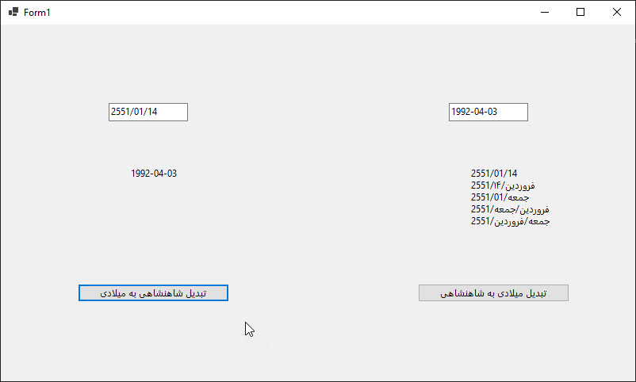

تقویم شاهنشاهی (تقویم ایران باستان)

یک برنامه ویندوز فرم نوشته شده با سی شارپ و دات نت کور ۹ برای تبدیل تاریخ بین تقویم میلادی و تقویم شاهنشاهی ایران.

## درباره تقویم شاهنشاهی

تقویم شاهنشاهی ایران، که به عنوان تقویم شاهنشاهی نیز شناخته می‌شود، تاریخچه‌ای غنی به قدمت ۲۵۰۰ سال دارد. در حال حاضر در سال ۲۵۸۳ این تقویم باستانی قرار داریم.

## امکانات

- تبدیل تاریخ از میلادی به تقویم شاهنشاهی
- تبدیل تاریخ از تقویم شاهنشاهی به میلادی
- رابط کاربری مدرن و کاربرپسند
- ساخته شده با دات نت کور ۹

## تصویر برنامه

## جزئیات فنی

- پلتفرم: ویندوز فرم
- زبان برنامه‌نویسی: سی شارپ
- فریم‌ورک: دات نت کور ۹
